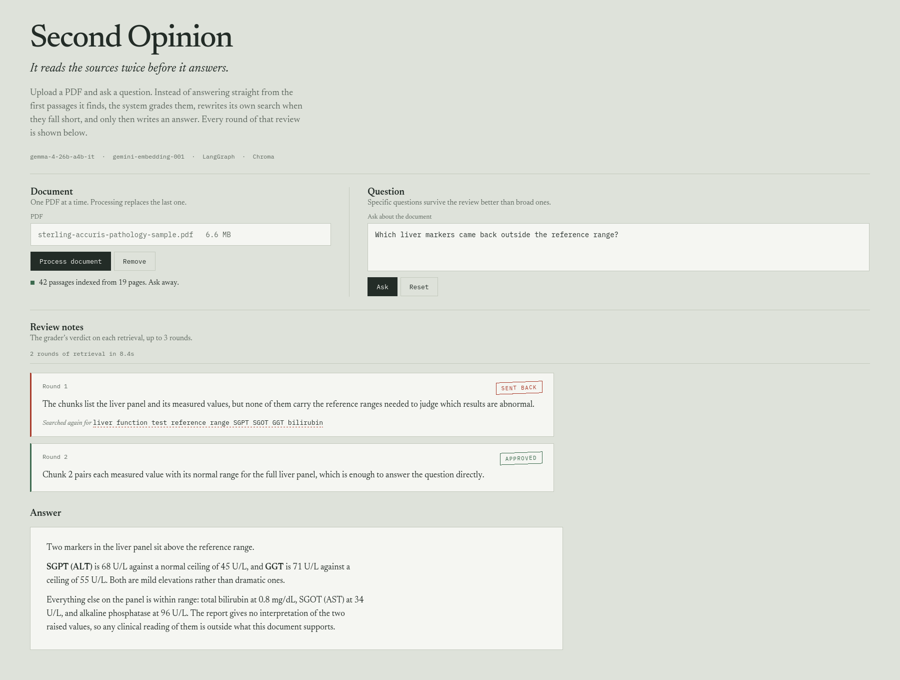

# Second Opinion

**A self-reflective agentic RAG pipeline that grades its own retrieval before it answers.**

Ask a question about a PDF. Before the model writes anything, it checks whether the passages it pulled back are actually good enough to answer with.

Most RAG pipelines skip that step. They embed the question, grab the top few chunks, and hand them straight to the model. When retrieval misses, the model still answers, because that is what models do. You get a fluent paragraph built on the wrong four chunks and no signal that anything went wrong.

This project puts a grader in between. After retrieval, the LLM reads the chunks and returns a verdict: are they relevant, is there enough here, do they contradict each other? On a `NO` it also writes a better search query, and the loop runs again with that query instead. Answer generation only happens once the context passes, or after three rounds, whichever comes first.

The whole review is printed in the UI, one slip per round, so you can see why it looped and what it searched for the second time.



## How the loop runs

```
   retrieve ──► grade ──► YES ──► generate ──► done
      ▲           │
      │           NO
      │           ▼
      └──────  rewrite query          (max 3 rounds, then generate anyway)
```

Four nodes on a LangGraph state machine:

| Node | What it does |
| --- | --- |
| `retrieve` | Similarity search for the top 4 chunks, using the current query |
| `grade_retrieval` | Asks the LLM for `VERDICT`, `REASON`, and `REFINED_QUERY` in a fixed format |
| `rewrite_query` | Parses `REFINED_QUERY` out of that reply and puts it in state |
| `generate` | Writes the answer, told to stay inside the context and to say when something is missing |

The router reads the verdict line. `YES` goes to `generate`. `NO` goes to `rewrite_query` and back around. Once `iterations` hits `MAX_ITERATIONS` the router forces `generate` with the best context it has, rather than looping forever on a question the document simply cannot answer.

The original question is never overwritten. Only `refined_query` changes between rounds, so grading and generation always judge against what the user actually asked.

## What it costs

Worth knowing before you build on this:

- **Two to seven LLM calls per question** instead of one. One grading call per round, plus the final generation.
- **Slower.** A question that loops twice takes roughly three times as long as plain RAG. That is the tradeoff for not answering from bad context.
- **The grader is the same model being graded.** It catches obvious retrieval misses well. It will not catch a subtle misreading of a chunk it already believes.
- **Format parsing is string matching.** The prompt asks for `VERDICT: / REASON: / REFINED_QUERY:` and the parser reads those prefixes. If the model wanders off format, `rewrite_query` falls back to the original question and the router falls through to `rewrite`. Structured output would be sturdier.

## Requirements

- Python 3.12+
- [uv](https://docs.astral.sh/uv/)
- A Google AI Studio API key with access to Gemma and Gemini embeddings

## Setup

```bash
git clone https://github.com/hariharan-sabapathi/Second-Opinion
cp .env.example .env
```

Put your key in `.env`:

```env
GEMINI_API_KEY=your_google_ai_studio_key_here
```

Keys come from [Google AI Studio](https://aistudio.google.com/app/apikey).

```bash
uv sync
uv run main.py
```

Then open `http://127.0.0.1:7860`.

## Using it

Upload a PDF and press **Process document**. The status line tells you how many passages were indexed. Ask a question, and the review notes fill in as the loop runs, followed by the answer.

Processing a new PDF deletes the previous vector store, so there is only ever one document loaded. **Remove** clears it without loading a replacement.

Questions that name something specific ("what were the exclusion criteria?") pass review far more often than broad ones ("what's in this PDF?"), because a broad question gives the grader nothing concrete to check sufficiency against.

## Things you might want to change

Everything tunable lives near the top of the two files:

- `MAX_ITERATIONS` in `rag_graph.py` — how many rounds before it gives up and answers anyway
- `k=4` in the `retrieve` node — how many chunks come back per round
- `CHUNK_SIZE` and `CHUNK_OVERLAP` in `main.py` — 1000/200 is a reasonable default for prose, too coarse for tables
- The grading prompt in `grade_retrieval` — the three criteria and the strictness of the judge

## Layout

```text
Second-Opinion/
├── main.py          # Gradio UI, PDF loading, chunking, indexing
├── rag_graph.py     # LangGraph nodes, router, and compiled app
├── assets/
│   └── demo.png
├── .env.example
├── pyproject.toml
├── uv.lock
└── README.md
```

## Known limits

- One document at a time, and the index is wiped on every upload. There is no collection management.
- No source citations in the answer. The chunks are numbered in the context but the generation prompt does not ask the model to cite them.
- No conversation history. Each question is independent.
- PDFs only, and only ones with a text layer. Scanned pages need OCR first.
